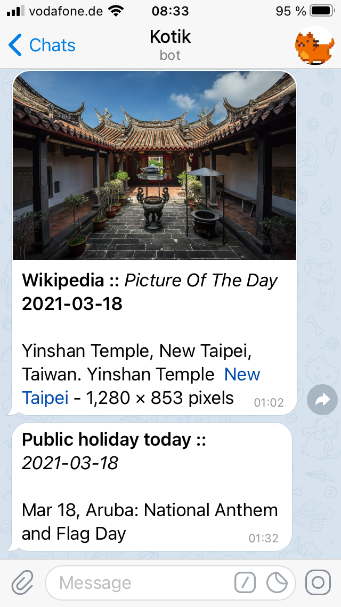

# kotik-bot


Educational messenger bot. However, the `Telegram` is the only supported platform at the moment.

Kotik brings things for discussion or something that is simply good to know. 

Available as https://t.me/kotik_elegant_bot.

## Build

```shell script
$ ./gradlew clean build
```

## Configuration

Consider environment variables.
* `TELEGRAM_TOKEN` - self-explanatory token for establishing connection to the Telegram.

Classical spring configuration.
* `SPRING_PROFILES_ACTIVE`
* `SPRING_DATASOURCE_URL`
* `SPRING_DATASOURCE_PASSWORD`
* `SPRING_DATASOURCE_USERNAME`

## Look


